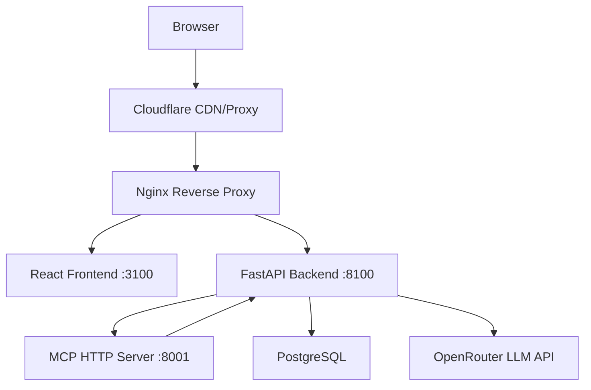

# HealthPrior — Clinical AI Prior Authorization

HealthPrior is a prototype AI system for clinical note structuring and prior authorization automation. It uses LLMs via OpenRouter to parse unstructured clinical notes into FHIR R4 structured data, evaluates against payer coverage criteria (Molina MCR-621), and generates prior authorization packages — all orchestrated through an MCP server.

## Architecture



## Live Demo

https://healthprior.volskyi-dmytro.com

## Local Setup

```bash
cp .env.example .env
# Fill in your API keys in .env
docker compose up --build
```

- Frontend: http://localhost:3100
- Backend API: http://localhost:8100
- API Docs: http://localhost:8100/docs

## Testing

```bash
cd backend && pytest tests/ -v
```

## API Endpoints

### Notes
| Method | Path | Description |
|--------|------|-------------|
| GET | /notes/samples | List sample clinical notes |
| GET | /notes/samples/{id} | Get a specific sample note |
| POST | /notes/structure | Structure note into FHIR bundle (accepts `model`, `model_b`, `policy_id`) |
| POST | /notes/structure/stream | SSE streaming endpoint — FHIR cards stream in as LLM produces them |

### Coverage
| Method | Path | Description |
|--------|------|-------------|
| POST | /coverage/evaluate | Evaluate FHIR bundle against policy criteria (accepts `policy_id`) |

### Policies
| Method | Path | Description |
|--------|------|-------------|
| GET | /policies | List all available payer policies |
| POST | /policies | Add a new policy (admin only) |
| GET | /policies/{policy_id} | Get policy criteria by ID |

### Prior Auth & Submissions
| Method | Path | Description |
|--------|------|-------------|
| POST | /prior-auth/generate | Generate prior auth package |
| GET | /prior-auth/{id}/pdf | Download prior auth letter as PDF |
| GET | /prior-auth/history | Paginated submission history (`?page=1&limit=20&decision=APPROVED&from=2025-01-01`) |
| GET | /prior-auth/submissions/{id}/audit | Full audit trail for a submission |

### Auth
| Method | Path | Description |
|--------|------|-------------|
| GET | /auth/login | GitHub OAuth login redirect |
| GET | /auth/callback | GitHub OAuth callback |
| GET | /auth/me | Current session info |
| POST | /auth/logout | Clear session |

### System
| Method | Path | Description |
|--------|------|-------------|
| GET | /health | Health check |

## MCP Server Tools

The MCP HTTP server (port 8001) exposes the following tools for AI agent use:

- `get_coverage_criteria` — Retrieve structured coverage criteria for a payer policy (e.g. Molina MCR-621)
- `search_icd10_codes` — Map a clinical condition description to relevant ICD-10 codes
- `validate_fhir_resource` — Validate a FHIR resource structure and return errors/warnings
- `get_prior_auth_requirements` — Get prior auth documentation requirements for a CPT code and payer
- `health_check` — Health check for the MCP server

## Phase 2 Features

### Multi-Policy Support
Policies are stored in the `policies` DB table and seeded at startup. The `policy_id` parameter is available on `/notes/structure` and `/coverage/evaluate` (defaults to `MCR-621`). The frontend Step 1 includes a policy selector dropdown.

### Submission History & Search
`GET /prior-auth/history` supports pagination and filtering:
```
GET /prior-auth/history?page=1&limit=20&decision=APPROVED&from=2025-01-01
```
The frontend `/history` route provides a full-page table with CSV export.

### FHIR Validation
After LLM structuring, each FHIR resource is validated for required fields (`_sourceRef`, `code`, etc.). On failure, the LLM is retried once with a clarifying prompt before returning HTTP 422.

### Audit Log
Every LLM call (note structuring, coverage evaluation, prior auth generation) is recorded in the `audit_log` table with model name, token usage, latency, and MCP tools called. View via `GET /prior-auth/{id}/audit` or the Audit Trail tab in the UI.

### PDF Prior Auth Letter
`GET /prior-auth/{id}/pdf` returns a formatted PDF letter (ReportLab) ready for faxing to a payer. The frontend Step 4 includes a "Download PDF Letter" button alongside "Download JSON".

### Real-Time Streaming (SSE)
`POST /notes/structure/stream` streams FHIR cards as the LLM produces them using Server-Sent Events. The frontend uses `@microsoft/fetch-event-source` so FHIR cards appear one by one during processing.

### Model Comparison Mode
Pass `model_b` to `POST /notes/structure` to run two models in parallel (`asyncio.gather`). The frontend Step 1 has a "Compare Models" toggle that reveals a second model picker. Step 2 renders both FHIR bundles side by side.

## Policy Ingestion

Coverage criteria are stored as structured JSON in `backend/app/data/` and loaded at runtime via `policy_loader.py`. The included `mcr_621_criteria.json` (MCR-621 → lowercase → `-` replaced with `_`) was extracted from the Molina MCR-621 PDF (Lumbar Spine MRI, CPT 72148/72149/72158).

To regenerate criteria JSON from an updated PDF:

```bash
cd backend
python scripts/ingest_policy.py --pdf path/to/Lumbar_Spine_MRI.pdf --policy MCR-621
```

## Feature Flags

| Env Var | Default | Description |
|---------|---------|-------------|
| `ENABLE_PDF_EXPORT` | `true` | Enable PDF prior auth letter generation |

## GitHub Secrets Required

| Secret | Description |
|--------|-------------|
| DOCKER_USERNAME | Docker Hub username |
| DOCKER_PASSWORD | Docker Hub password |
| VPS_SSH_KEY | Private SSH key for VPS deployment |
| VPS_HOST | VPS IP address |
| VPS_USER | VPS SSH username |
| OPENROUTER_API_KEY | OpenRouter API key for LLM access |
| DATABASE_URL | Production PostgreSQL connection string |
