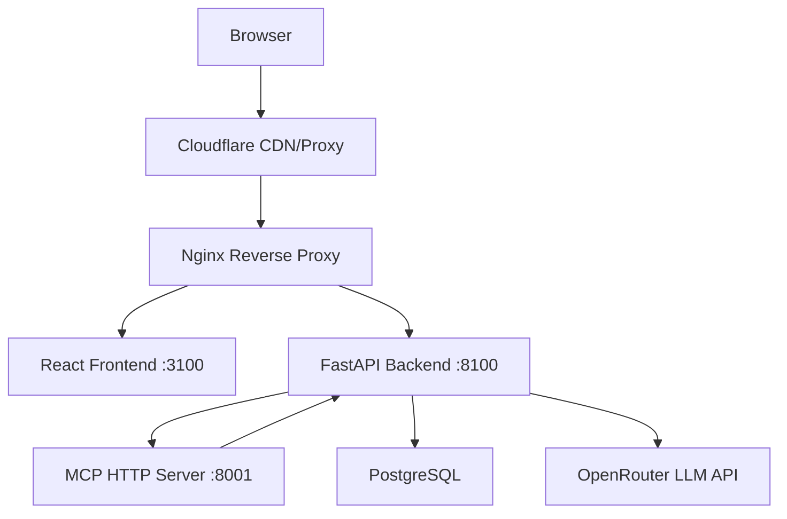

# HealthPrior — Clinical AI Prior Authorization

HealthPrior is a prototype AI system for clinical note structuring and prior authorization automation. It uses LLMs via OpenRouter to parse unstructured clinical notes into FHIR-compatible structured data and generate prior authorization requests.

## Architecture



## Live Demo

https://healthprior.volskyi-dmytro.com

## Local Setup

```bash
cp .env.example .env
# Fill in your API keys in .env
docker compose up --build
```

- Frontend: http://localhost:3100
- Backend API: http://localhost:8100
- API Docs: http://localhost:8100/docs

## Testing

```bash
cd backend && pytest tests/ -v
```

## API Endpoints

| Method | Path | Description |
|--------|------|-------------|
| GET | /health | Health check |
| POST | /notes/parse | Parse clinical note into structured FHIR data |
| POST | /notes/structure | Structure note with ICD-10/CPT codes |
| GET | /coverage/{patient_id} | Check insurance coverage |
| POST | /prior-auth/generate | Generate prior auth request |
| GET | /prior-auth/{id}/status | Check prior auth status |

## MCP Server Tools

The MCP HTTP server (port 8001) exposes the following tools for AI agent use:

- `get_coverage_criteria` — Retrieve structured coverage criteria for a payer policy (e.g. Molina MCR-621)
- `search_icd10_codes` — Map a clinical condition description to relevant ICD-10 codes
- `validate_fhir_resource` — Validate a FHIR resource structure and return errors/warnings
- `get_prior_auth_requirements` — Get prior auth documentation requirements for a CPT code and payer
- `health_check` — Health check for the MCP server

## Policy Ingestion

Coverage criteria are stored as structured JSON in `backend/app/data/` and loaded at runtime via `policy_loader.py`. The included `molina_mcr621_criteria.json` was extracted from the Molina MCR-621 PDF (Lumbar Spine MRI, CPT 72148/72149/72158).

To regenerate criteria JSON from an updated PDF:

```bash
cd backend
python scripts/ingest_policy.py --pdf path/to/Lumbar_Spine_MRI.pdf --policy MCR-621
```

## GitHub Secrets Required

| Secret | Description |
|--------|-------------|
| DOCKER_USERNAME | Docker Hub username |
| DOCKER_PASSWORD | Docker Hub password |
| VPS_SSH_KEY | Private SSH key for VPS deployment |
| VPS_HOST | VPS IP address |
| VPS_USER | VPS SSH username |
| OPENROUTER_API_KEY | OpenRouter API key for LLM access |
| OPENAI_API_KEY | OpenAI API key (fallback) |
| DATABASE_URL | Production PostgreSQL connection string |
