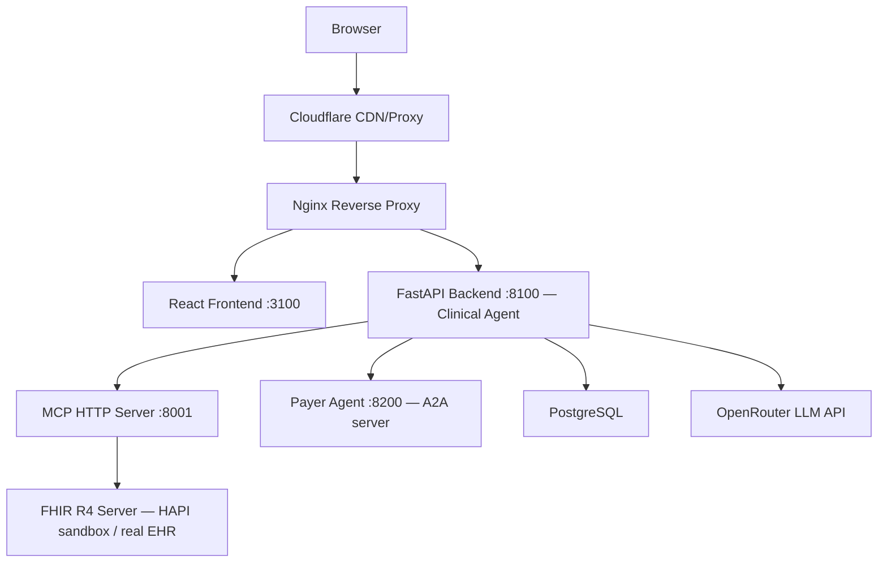

# HealthPrior — Clinical AI Prior Authorization

HealthPrior is a prototype AI system for clinical note structuring and prior authorization automation. It parses unstructured clinical notes into FHIR R4 structured data, evaluates against payer coverage criteria (Molina MCR-621), and generates prior authorization packages — orchestrated through a three-protocol stack: SMART on FHIR (data access), MCP (LLM-to-tool interface), and A2A (inter-agent communication).

## Architecture



## Protocol Stack

HealthPrior demonstrates three interoperability protocols working together:

| Protocol | Role | Implementation |
|----------|------|----------------|
| **SMART on FHIR** | Patient data access layer | Live FHIR server fetch via MCP `fetch_patient_record` tool; queries HAPI sandbox or any FHIR R4 server |
| **MCP (Model Context Protocol)** | LLM-to-tool interface | Clinical Agent calls MCP tools to retrieve real FHIR data and coverage criteria before prompting the LLM |
| **A2A (Agent-to-Agent)** | Inter-agent communication | Clinical Agent delegates coverage evaluation to the Payer Agent via A2A task submission; supports streaming SSE and multi-turn `input-required` flows |

## Live Demo

https://healthprior.volskyi-dmytro.com

## Local Setup

```bash
cp .env.example .env
# Fill in your API keys in .env
docker compose up --build
```

- Frontend: http://localhost:3100
- Backend API: http://localhost:8100
- API Docs: http://localhost:8100/docs
- MCP Server: http://localhost:8001
- Payer Agent: http://localhost:8200

## Testing

```bash
cd backend && pytest tests/ -v
```

## User Workflow

The interface is a 4-step wizard. Step 1 supports two input modes:

**Step 1a — Paste clinical note**
POST `/notes/structure` — LLM extracts a FHIR bundle from raw text, grounded by MCP context.

**Step 1b — Fetch from FHIR Server**
POST `/notes/fetch-fhir` — MCP tool fetches a live patient record (Patient, Conditions, MedicationRequests, Observations) directly from a FHIR R4 server. No LLM required; real structured data comes back immediately.

**Step 2** — Review FHIR resources (Condition, MedicationRequest, Observation entries). Source citations link each resource back to the raw note section it came from.

**Step 3** — POST `/coverage/evaluate` — Clinical Agent submits the FHIR bundle to the Payer Agent via A2A. The Payer Agent evaluates against MCR-621 criteria and returns APPROVED / DENIED / NEEDS_MORE_INFO.

**Step 4** — POST `/prior-auth/generate` — Produces a prior auth package (saved to DB). Download as JSON or PDF. View the audit trail for every LLM call, token usage, and MCP tools invoked.

## API Endpoints

### Notes
| Method | Path | Description |
|--------|------|-------------|
| GET | /notes/samples | List sample clinical notes |
| GET | /notes/samples/{id} | Get a specific sample note |
| POST | /notes/structure | Structure note into FHIR bundle (accepts `model`, `model_b`, `policy_id`) |
| POST | /notes/structure/stream | SSE streaming endpoint — FHIR cards stream in as LLM produces them |
| POST | /notes/fetch-fhir | Fetch real patient FHIR bundle from a FHIR R4 server (`patient_id`, `fhir_server_url`) |

### Coverage
| Method | Path | Description |
|--------|------|-------------|
| POST | /coverage/evaluate | Evaluate FHIR bundle against policy criteria (accepts `policy_id`) |

### Policies
| Method | Path | Description |
|--------|------|-------------|
| GET | /policies | List all available payer policies |
| POST | /policies | Add a new policy (admin only) |
| GET | /policies/{policy_id} | Get policy criteria by ID |

### Prior Auth & Submissions
| Method | Path | Description |
|--------|------|-------------|
| POST | /prior-auth/generate | Generate prior auth package |
| GET | /prior-auth/{id}/pdf | Download prior auth letter as PDF |
| GET | /prior-auth/history | Paginated submission history (`?page=1&limit=20&decision=APPROVED&from=2025-01-01`) |
| GET | /prior-auth/submissions/{id}/audit | Full audit trail for a submission |

### Auth
| Method | Path | Description |
|--------|------|-------------|
| GET | /auth/github | GitHub OAuth login redirect |
| GET | /auth/callback | GitHub OAuth callback |
| GET | /auth/me | Current session info |
| GET | /auth/logout | Clear session |

### System
| Method | Path | Description |
|--------|------|-------------|
| GET | /health | Health check |

## MCP Server Tools

The MCP HTTP server (port 8001) exposes 8 tools for AI agent use:

**Coverage & policy tools:**
- `get_coverage_criteria` — Retrieve structured coverage criteria for a payer policy (e.g. Molina MCR-621)
- `search_icd10_codes` — Map a clinical condition description to relevant ICD-10 codes
- `validate_fhir_resource` — Validate a FHIR resource structure and return errors/warnings
- `get_prior_auth_requirements` — Get prior auth documentation requirements for a CPT code and payer
- `health_check` — Health check for the MCP server

**FHIR data access tools (SMART on FHIR):**
- `fetch_patient_record` — Fetches Patient + Conditions + MedicationRequests + Observations from a FHIR R4 server in parallel using four concurrent search operations
- `search_fhir_resources` — Generic FHIR search by resource type and SearchParameters
- `get_structure_definition` — Retrieves and caches the FHIR R4 StructureDefinition for a given resource type, providing schema grounding for accurate resource construction

## MCP Tool Discovery

```
GET http://localhost:8001/.well-known/mcp.json
```

Returns a machine-readable JSON document describing all available tools, their input schemas, supported capabilities, and the FHIR base URL. This is the discovery mechanism used by A2A-compatible agents to understand what the MCP server can do before invoking any tool.

```json
{
  "schema_version": "1.0",
  "name": "HealthPrior Clinical MCP Server",
  "tools": [...],
  "fhir_base": "https://hapi.fhir.org/baseR4",
  "capabilities": ["fhir_search", "fhir_read", "icd10_lookup", "fhir_validation", "coverage_criteria"]
}
```

## Payer Agent (A2A)

The Payer Agent runs on port 8200 and implements the A2A (Agent-to-Agent) protocol for coverage evaluation. The Clinical Agent (backend) delegates evaluation tasks to it rather than running evaluation inline.

### Agent Discovery

```
GET http://localhost:8200/.well-known/agent.json
```

Returns an AgentCard with the agent's name, URL, capabilities (including `streaming: true`), and skills.

### A2A Task Endpoints

| Method | Path | Description |
|--------|------|-------------|
| POST | /tasks/send | Submit FHIR bundle for coverage evaluation — returns 202 with `task_id` |
| GET | /tasks/{task_id} | Poll task status and retrieve result |
| POST | /tasks/sendSubscribe | SSE stream of state transitions for real-time updates |
| POST | /tasks/{task_id}/send | Submit an answer when the task is in `input-required` state |
| GET | /.well-known/agent.json | AgentCard — A2A agent discovery |

### Task Lifecycle

```
submitted → working → completed
                    → input-required → working → completed
                    → failed
```

When the payer needs more clinical information (NEEDS_MORE_INFO decision), the task transitions to `input-required` and the status message contains the question text. The calling agent (or UI) can then POST a reply to `/tasks/{task_id}/send` to continue the evaluation with the additional context.

## Phase 2 Features

### Multi-Policy Support
Policies are stored in the `policies` DB table and seeded at startup. The `policy_id` parameter is available on `/notes/structure` and `/coverage/evaluate` (defaults to `MCR-621`). The frontend Step 1 includes a policy selector dropdown.

### Submission History & Search
`GET /prior-auth/history` supports pagination and filtering:
```
GET /prior-auth/history?page=1&limit=20&decision=APPROVED&from=2025-01-01
```
The frontend `/history` route provides a full-page table with CSV export.

### FHIR Validation
After LLM structuring, each FHIR resource is validated for required fields (`_sourceRef`, `code`, etc.). On failure, the LLM is retried once with a clarifying prompt before returning HTTP 422.

### Audit Log
Every LLM call (note structuring, coverage evaluation, prior auth generation) is recorded in the `audit_log` table with model name, token usage, latency, and MCP tools called. View via `GET /prior-auth/{id}/audit` or the Audit Trail tab in the UI.

Audit entries are linked to submissions via a `session_id` UUID generated by the frontend at wizard start and threaded through all three API calls (`/notes/structure`, `/coverage/evaluate`, `/prior-auth/generate`). This allows the Audit Trail tab to show token counts and latency for every LLM call in a submission, not just the final packaging step.

### PDF Prior Auth Letter
`GET /prior-auth/{id}/pdf` returns a formatted PDF letter (ReportLab) ready for faxing to a payer. The frontend Step 4 includes a "Download PDF Letter" button alongside "Download JSON".

### Real-Time Streaming (SSE)
`POST /notes/structure/stream` streams FHIR cards as the LLM produces them using Server-Sent Events. The frontend uses `@microsoft/fetch-event-source` so FHIR cards appear one by one during processing.

### Model Comparison Mode
Pass `model_b` to `POST /notes/structure` to run two models in parallel (`asyncio.gather`). The frontend Step 1 has a "Compare Models" toggle that reveals a second model picker. Step 2 renders both FHIR bundles side by side.

## Policy Ingestion

Coverage criteria are stored as structured JSON in `backend/app/data/` and loaded at runtime via `policy_loader.py`. The included `mcr_621_criteria.json` (MCR-621 → lowercase → `-` replaced with `_`) was extracted from the Molina MCR-621 PDF (Lumbar Spine MRI, CPT 72148/72149/72158).

To regenerate criteria JSON from an updated PDF:

```bash
cd backend
python scripts/ingest_policy.py --pdf path/to/Lumbar_Spine_MRI.pdf --policy MCR-621
```

## Feature Flags

| Env Var | Default | Description |
|---------|---------|-------------|
| `ENABLE_PDF_EXPORT` | `true` | Enable PDF prior auth letter generation |

## GitHub Secrets Required

| Secret | Description |
|--------|-------------|
| DOCKER_USERNAME | Docker Hub username |
| DOCKER_PASSWORD | Docker Hub password |
| VPS_SSH_KEY | Private SSH key for VPS deployment |
| VPS_HOST | VPS IP address |
| VPS_USER | VPS SSH username |
| OPENROUTER_API_KEY | OpenRouter API key for LLM access |
| DATABASE_URL | Production PostgreSQL connection string |

## Standards Compliance & Known Gaps

### DaVinci Prior Authorization Support (PAS) IG

The prior auth package generated by HealthPrior is **DaVinci PAS-inspired** but not fully standards-compliant with the [HL7 DaVinci PAS IG](https://build.fhir.org/ig/HL7/davinci-pas/).

| Requirement | Status | Notes |
|-------------|--------|-------|
| FHIR `Claim` resource | ❌ Not implemented | Uses `ServiceRequest` instead |
| FHIR `ClaimResponse` resource | ❌ Not implemented | Decision returned as custom JSON |
| `$submit` operation against payer endpoint | ❌ Not implemented | A2A protocol used instead |
| X12 278 EDI transaction | ❌ Not implemented | Out of scope for prototype |
| FHIR Bundle `transaction` type | ✅ Implemented | Used for A2A payload |

**Gap**: A production implementation would need to replace the `ServiceRequest`-based bundle with a `Claim` resource conforming to the [PAS Claim profile](https://build.fhir.org/ig/HL7/davinci-pas/StructureDefinition-profile-claim.html), and the payer agent would return a `ClaimResponse`.

### SMART on FHIR

The "Fetch from FHIR Server" feature connects directly to public FHIR R4 endpoints (e.g., HAPI sandbox) without authentication. Production EHR integration would require [SMART App Launch Framework](https://hl7.org/fhir/smart-app-launch/) (STU2):

| Requirement | Status | Notes |
|-------------|--------|-------|
| SMART launch sequence | ❌ Not implemented | GitHub OAuth used for user auth only |
| `/.well-known/smart-configuration` | ✅ Stub implemented | Returns SMART on FHIR discovery document; token exchange not wired |
| EHR launch context (`launch`, `patient` scopes) | ❌ Not implemented | — |
| Authenticated FHIR queries | ❌ Not implemented | Public HAPI sandbox only |

**Gap**: The current implementation is suitable for demo purposes with public FHIR servers. Connecting to a real EHR (Epic, Cerner) would require SMART App Launch registration and token exchange.

## Changelog

### 2026-03-10
- **fix**: Corrected README auth endpoint table — `/auth/login` → `/auth/github`, `/auth/logout` method `POST` → `GET`
- **feat**: Added `/.well-known/smart-configuration` GET endpoint stub to backend (SMART on FHIR App Launch STU2 discovery document)
- **fix**: MCP server `/.well-known/mcp.json` verified to include all 8 registered tools (`search_fhir_resources`, `get_structure_definition`, `fetch_patient_record` confirmed present)

### 2026-03-09
- **fix**: Resolved A2A schema mismatch — `metadata` fields in `Message`, `Task`, and `SendTaskRequest` now accept `null` from the payer agent, eliminating the Pydantic `ValidationError` that caused all coverage evaluation polls to return HTTP 500 after ~8 seconds
- **fix**: `_extract_fhir_and_policy` now correctly reads `policy_id` from `message.metadata` (where the backend sends it) in addition to `DataPart.data`
- **feat**: Confidence score calibration added to all LLM evaluation prompts — scores now use the full 0–1 range instead of defaulting to 0.9
