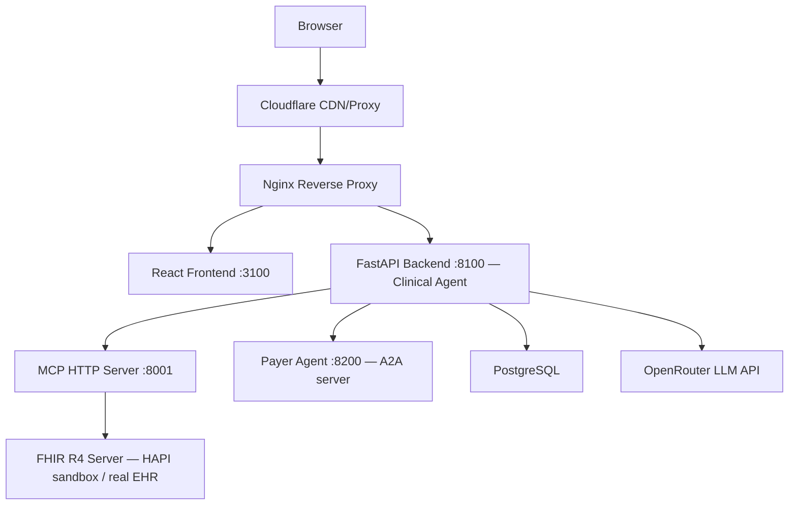

# HealthPrior: How It Works Under the Hood

**Audience:** Senior engineers, technical interviewers, CTOs
**Purpose:** Architectural decisions, data flows, and engineering trade-offs

---

## 1. Architecture Overview

HealthPrior is a five-service containerized stack. Each service has a single, well-defined responsibility:



**Why each service is separate:**

- **React Frontend** — pure presentation and wizard state; all API calls are fire-and-forget from the browser's perspective. The frontend generates a `session_id` UUID at wizard start and passes it through every subsequent API call to thread audit records together.
- **FastAPI Backend (Clinical Agent)** — orchestrates the workflow: MCP pre-flight, LLM calls, FHIR validation, audit logging, DB persistence. It acts as the "clinical" side of the agent pair.
- **MCP Server** — a reusable, independently deployable tool layer. It exposes eight tools over JSON-RPC that any MCP-compatible agent can call. Separating it means the backend never hard-codes policy data or FHIR query logic — it asks the MCP server.
- **Payer Agent** — runs coverage evaluation independently. It can be scaled, replaced, or versioned without touching the backend. It uses its own LLM instance and task store.
- **PostgreSQL** — JSONB columns for FHIR bundles and prior auth packages avoid schema migrations every time a new policy type is added.

---

## 2. The Three-Protocol Stack

HealthPrior deliberately demonstrates three healthcare/AI interoperability protocols working together:

| Protocol | Role | Why chosen |
|---|---|---|
| **SMART on FHIR** | Patient data access | Industry standard for EHR interoperability; the `fetch_patient_record` MCP tool can query any FHIR R4 server without custom integration per EHR vendor |
| **MCP (Model Context Protocol)** | LLM-to-tool interface | Anthropic's open protocol for giving LLMs access to tools; decouples "what the LLM knows" from "what data exists" — the backend calls MCP tools to ground prompts with real policy criteria and StructureDefinitions before the LLM runs |
| **A2A (Agent-to-Agent)** | Inter-agent communication | Separates the clinical agent (note extraction, orchestration) from the payer agent (coverage evaluation); enables independent scaling, different LLM models per agent, and a proper async task lifecycle with multi-turn continuation |

The MCP server exposes a machine-readable discovery document at `GET /.well-known/mcp.json`, and the Payer Agent exposes an AgentCard at `GET /.well-known/agent.json`. Both follow the convention that an agent or tool server announces itself at a well-known URL before any tool or task is invoked.

---

## 3. Step 1: Clinical Note → FHIR Bundle

### The request path

When the user submits a note to `POST /notes/structure` (`backend/app/api/notes.py`), the handler:

1. Instantiates `MCPClient` and calls `get_coverage_criteria("MCR-621")` — a JSON-RPC `tools/call` to the MCP server at `POST /mcp/`. This returns the structured Molina MCR-621 criteria from `app/data/mcr_621_criteria.json`.
2. Passes the criteria as `mcp_context` into `LLMService.structure_note_retry()`.

### MCP pre-flight

The MCP call is not optional context — it is the mechanism that grounds the LLM. The criteria JSON tells the model which conditions, treatments, and exam findings matter for this policy, shaping which FHIR resources it prioritizes during extraction. A separate `get_structure_definition` tool (also on the MCP server) can be called to fetch the canonical FHIR R4 StructureDefinition for any resource type, cached in `_sd_cache` at the module level to avoid redundant network fetches.

### LLM call and system prompt

`LLMService` (`backend/app/services/llm_service.py`) calls OpenRouter at `temperature=0.1` — chosen for near-determinism, which is critical for clinical use where the same note should produce the same structured output across runs. The system prompt (`FHIR_EXTRACTION_SYSTEM`) instructs the model to:

- Return a strict JSON shape with `patient_demographics` and an `entry` array of Condition, MedicationRequest, and Observation resources.
- Attach a `_sourceRef` field to every resource, citing the exact section of the note it came from (e.g., `"ASSESSMENT & PLAN"`, `"PHYSICAL EXAMINATION"`).
- Use real ICD-10 codes and SNOMED codes where known.

The `_sourceRef` field is a non-FHIR extension that drives source citation in the Step 2 UI — each card links back to the note section that produced it.

### Retry logic

`structure_note_retry()` in `llm_service.py` calls `structure_note_with_meta()`, then runs `validate_fhir_bundle()` (from `app/services/fhir_validator.py`) on the result. If validation fails — for example, a Condition missing `code` or `clinicalStatus` — it constructs a second prompt using `FHIR_RETRY_CLARIFICATION` that includes the exact validation errors from the first attempt. If the second attempt also fails validation, the endpoint returns HTTP 422. There is no third attempt; the design assumption is that two chances is sufficient and infinite retries could mask a broken prompt.

### SSE streaming variant

`POST /notes/structure/stream` streams FHIR resource cards as the LLM produces them using Server-Sent Events. The frontend uses `@microsoft/fetch-event-source` so cards appear one by one rather than waiting for the full bundle. The backend yields each resource as it is parsed from the streaming LLM response.

### Model comparison mode

If the request includes `model_b`, the handler runs:

```python
result_a, result_b = await asyncio.gather(
    _structure_with_model(note, model_a, mcp_context, db, ...),
    _structure_with_model(note, model_b, mcp_context, db, ...),
)
```

Both LLM calls execute concurrently. The response includes both bundles; Step 2 renders them side by side. Both calls are independently audit-logged with their own token counts and latency.

---

## 4. Step 2: FHIR Bundle Review

The FHIR bundle returned to the frontend is a `collection`-type Bundle containing three resource types:

- **Condition** — diagnoses with ICD-10 codes, clinical status, and supporting evidence
- **MedicationRequest** — current medications with dosage instructions
- **Observation** — physical exam findings (SLR test, reflexes, motor strength, sensory findings, vital signs)

The `_sourceRef` field on each resource is rendered in the UI as a citation badge. When a reviewer clicks a resource card, they can see exactly which section of the original note the LLM pulled it from. This is a deliberate design for clinical auditability — an LLM claim should always trace to primary source text.

FHIR R4 is used specifically because it is the current US mandate for CMS interoperability rules, and any production system would need to exchange data with EHRs and payers using FHIR-conformant resources.

---

## 5. Step 3: Coverage Evaluation via A2A

### Async task lifecycle

`POST /coverage/evaluate` (`backend/app/api/coverage.py`) does not run the evaluation inline. It:

1. Creates an `A2AClient` and calls `client.send_task()`, which `POST /tasks/send` on the Payer Agent with the FHIR bundle serialized as a `DataPart` inside a `Message`, and `policy_id` in `message.metadata`.
2. The Payer Agent responds immediately with HTTP 202 and a `task_id`.
3. The backend returns `{"task_id": ..., "state": "submitted"}` to the frontend.
4. The frontend polls `GET /coverage/tasks/{task_id}` until `state` is `completed`, `failed`, or `input-required`.

The task lifecycle is:

```
submitted → working → completed
                    → input-required → working → completed
                    → failed
```

State transitions happen inside `_run_evaluation()` in `payer_agent/app/api/tasks.py`. The Payer Agent uses FastAPI `BackgroundTasks` to run evaluation after the 202 is sent — the HTTP response and the evaluation are fully decoupled.

### What the Payer Agent does

On receiving the task, the Payer Agent:

1. Calls `evaluation_service.evaluate()` with the FHIR bundle, `policy_id`, and full conversation `history` (so multi-turn context is preserved).
2. Instantiates its own `LLMService` — completely independent from the backend's LLM configuration. The payer agent could use a different model, API key, or temperature.
3. Feeds the FHIR bundle and the MCR-621 criteria into the `COVERAGE_EVALUATION_SYSTEM` prompt, which instructs the model to return `decision`, `matched_criteria`, `unmet_criteria`, `justification`, and `confidence_score`.

### Decision states

The three decision values map to distinct outcomes:

- `APPROVED` — at least one MCR-621 criterion is met; task transitions to `completed` with a `DataPart` artifact.
- `DENIED` — no coverage criteria met and exclusion criteria apply; also `completed` with a `DataPart` artifact.
- `NEEDS_MORE_INFO` — unclear clinical picture; task transitions to `input-required` and the status message contains a `TextPart` with the specific question.

### Multi-turn flow

When the task is `input-required`, the UI displays the question text from the status message. The user types a reply; the frontend calls `POST /coverage/tasks/{task_id}/reply` on the backend, which calls `A2AClient.reply_to_task()`, which `POST /tasks/{task_id}/send` on the Payer Agent. The Payer Agent appends the reply to `task.history` and re-runs `_run_evaluation()`. On the next evaluation pass, `evaluation_service.evaluate()` receives the full history, so the LLM has the additional clinical context.

### Confidence score

The `COVERAGE_EVALUATION_SYSTEM` prompt explicitly defines five calibration bands from 0.00 to 1.00, with labels tied to documentation quality. This was added after observing that without calibration guidance, the LLM defaulted to 0.9 for almost all evaluations, making the score meaningless for clinical triage.

---

## 6. Step 4: Prior Auth Package

`POST /prior-auth/generate` (`backend/app/api/prior_auth.py`) assembles the final prior authorization package from the FHIR bundle and coverage decision, saves a `PriorAuthSubmission` record to PostgreSQL with the following JSONB columns:

- `fhir_bundle` — the full structured bundle
- `coverage_result` — the coverage decision including justification and matched criteria
- `prior_auth_package` — the generated letter content, CPT/ICD codes, and clinical summary

Using JSONB avoids needing a schema migration when a new policy type with different criteria fields is added.

### Audit trail

Every LLM call across all three API endpoints is written to the `audit_log` table via `log_llm_call()` in `app/services/audit_service.py`:

- `event_type` — e.g., `"note_structured"`, `"coverage_evaluated"`, `"prior_auth_generated"`
- `model_used` — model identifier string
- `prompt_tokens`, `completion_tokens`, `latency_ms` — from `LLMCallResult`
- `mcp_tools_called` — list of tool names invoked before the LLM call (e.g., `["get_coverage_criteria"]`)
- `session_id` — the UUID generated by the frontend at wizard start

The `session_id` is the thread that links all three audit entries to one submission. When a reviewer opens the Audit Trail tab on Step 4, they see token counts and latency for every LLM call in that session, not just the final generation step. For A2A-delegated calls where no backend LLM runs, the `mcp_tools_called` field records `"a2a:task:{task_id}"` as a proxy identifier.

### PDF generation

`GET /prior-auth/{id}/pdf` generates a formatted letter via ReportLab, gated by the `ENABLE_PDF_EXPORT` environment variable (default `true`). The letter is suitable for faxing to a payer.

---

## 7. Key Engineering Decisions and Trade-offs

**OpenRouter instead of direct Anthropic API**
OpenRouter is a unified gateway that normalizes the API surface across providers (Anthropic, OpenAI, Mistral, etc.) behind a single key and a single `/chat/completions` endpoint. This means model comparison mode costs zero additional integration work — swapping model IDs is the entire change. The trade-off is an extra network hop and a third-party dependency in the inference path.

**In-memory task store in the Payer Agent**
`payer_agent/app/store/task_store.py` stores tasks in a module-level dict. For a prototype, this eliminates infrastructure (no Redis, no DB migrations on the agent side) and keeps the A2A lifecycle self-contained. The trade-off is obvious: tasks are lost on restart and the agent cannot be horizontally scaled. A production deployment would replace the store with Redis and pub/sub for SSE fan-out.

**JSONB in PostgreSQL for FHIR bundles**
FHIR bundles are stored as JSONB rather than being normalized into relational tables. The flexibility is significant: MCR-621 criteria are structurally different from, say, a cardiac or oncology policy. JSONB lets each bundle carry whatever the LLM extracted without requiring a column per field. The trade-off is that JSONB cannot be indexed or queried with the same efficiency as typed columns, which matters for the submission history filtering at scale.

**`asyncio.gather` for parallel LLM calls**
Model comparison mode runs both LLM calls concurrently rather than sequentially. This cuts user-facing latency roughly in half (from ~16 seconds to ~8 for two Claude Sonnet calls). The same pattern is used inside the `fetch_patient_record` MCP tool, which fires four concurrent FHIR search operations (Patient, Conditions, MedicationRequests, Observations) in one gather.

**Temperature 0.1 for all LLM calls**
Clinical extraction and coverage evaluation are not creative tasks. The same clinical note should produce the same FHIR bundle on every run. Temperature 0.1 (not 0.0, which some providers do not support) gives near-deterministic output while avoiding the edge cases where temperature 0.0 causes certain models to loop or refuse. The trade-off is a minor reduction in creative problem-solving ability, which is irrelevant here.

**One automatic FHIR validation retry before HTTP 422**
`structure_note_retry()` retries exactly once with the validation error context injected into the prompt. One retry is enough to catch the most common failure mode (missing required fields) without masking a fundamentally broken prompt. Two retries would add 8–12 seconds of latency on a failure path that should be rare in production. If the second attempt also fails, HTTP 422 is returned with the validation errors, and the caller (or the user) must intervene.

**DaVinci PAS compliance gap acknowledged**
The prior auth package uses a `ServiceRequest`-based bundle rather than the `Claim` resource required by the HL7 DaVinci PAS IG. This is a deliberate prototype shortcut. A production system would need to replace the `ServiceRequest` with a PAS-conformant `Claim` profile and have the Payer Agent return a `ClaimResponse`. The current design demonstrates the orchestration pattern; it does not attempt to substitute for the actual EDI/X12 278 transaction layer that payers use today.
